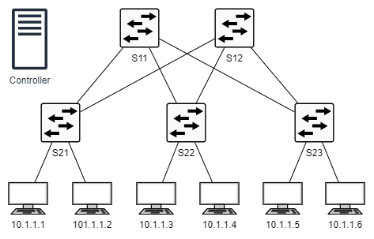
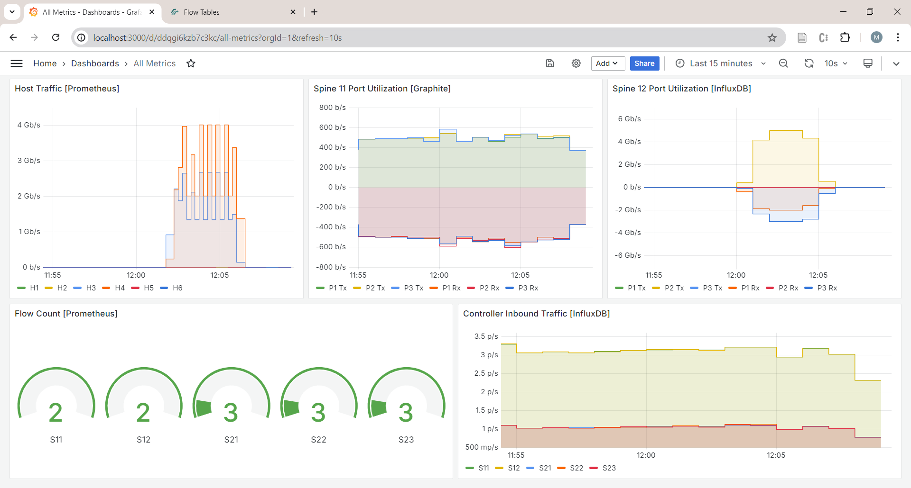
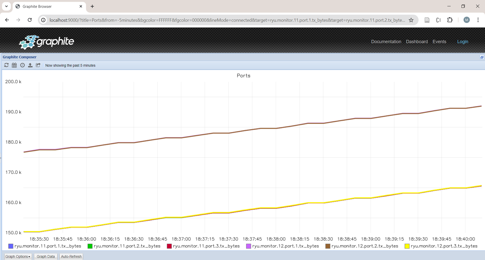

# SDN DDoS Detection Lab

Laboratorio de detección de ataques DDoS basado en **Software-Defined Networking (SDN)** con topología Spine-Leaf, emulada con Mininet y controlada por Ryu. Incluye stack de monitoreo completo (Grafana, Prometheus, InfluxDB, Graphite) y un pipeline de Machine Learning para análisis de tráfico malicioso.



---

## Tabla de Contenidos

- [¿De qué trata el laboratorio?](#de-qué-trata-el-laboratorio)
- [Arquitectura](#arquitectura)
- [Requisitos previos](#requisitos-previos)
- [Instalación de Docker en Kali Linux](#instalación-de-docker-en-kali-linux)
- [Instalación del laboratorio](#instalación-del-laboratorio)
- [Arranque del laboratorio](#arranque-del-laboratorio)
- [Comandos Makefile](#comandos-makefile)
- [Uso de Mininet](#uso-de-mininet)
- [Stack de Monitoreo](#stack-de-monitoreo)
- [Pipeline de Datos y ML](#pipeline-de-datos-y-ml)

---

## ¿De qué trata el laboratorio?

Este laboratorio simula una red de **centro de datos** usando una topología **Spine-Leaf** con 5 switches OpenFlow y 6 hosts, controlada por el controlador SDN **Ryu**. El objetivo es:

1. **Emular tráfico de red** (normal y malicioso) sobre una red SDN.
2. **Capturar y monitorear métricas** de los switches en tiempo real con Grafana, Prometheus, InfluxDB y Graphite.
3. **Generar ataques DDoS** (TCP flood, UDP flood, port scan) para estudiar su comportamiento en la red.
4. **Construir un dataset** a partir del tráfico capturado y entrenar un modelo de ML para detección de ataques.

### Componentes principales

| Componente | Rol |
|---|---|
| **Mininet** | Emulador de red (switches + hosts virtuales) |
| **Ryu** | Controlador SDN (OpenFlow) |
| **FlowManager** | GUI web para ver tablas de flujo y topología |
| **Grafana** | Dashboards de métricas de red |
| **Prometheus** | Base de datos de métricas (time-series) |
| **InfluxDB** | Base de datos de métricas (time-series) |
| **Graphite** | Base de datos de métricas + interfaz web |

---

## Arquitectura

```
┌─────────────┐    ┌─────────────────┐    ┌──────────────┐
│   infra/    │───▶│    pipeline/     │───▶│     ml/      │
│ topology    │    │ collect/process  │    │ train/predict│
│ controller  │    │ build_dataset    │    │ evaluate     │
│ attacks     │    └────────┬────────┘    └──────┬───────┘
│ monitoring  │             │                     │
└─────────────┘             ▼                     ▼
                    ┌──────────────┐      ┌──────────────┐
                    │    data/     │      │  monitoring/ │
                    │ raw/processed│      │   Grafana    │
                    │   models/    │      │  Prometheus  │
                    └──────────────┘      └──────────────┘
```

---

## Requisitos previos

- Kali Linux (o Debian/Ubuntu)
- Git
- Docker y Docker Compose (ver sección siguiente)
- Al menos 4 GB de RAM disponibles
- Conexión a internet para descargar las imágenes Docker

---

## Instalación de Docker en Kali Linux

Ejecuta los siguientes comandos en orden. Puedes copiar y pegar el bloque completo en la terminal:

```bash
# 1. Agregar la clave GPG oficial de Docker
sudo apt update
sudo apt install -y ca-certificates curl
sudo install -m 0755 -d /etc/apt/keyrings
sudo curl -fsSL https://download.docker.com/linux/debian/gpg -o /etc/apt/keyrings/docker.asc
sudo chmod a+r /etc/apt/keyrings/docker.asc

# 2. Agregar el repositorio de Docker
sudo tee /etc/apt/sources.list.d/docker.sources <<EOF
Types: deb
URIs: https://download.docker.com/linux/debian
Suites: bookworm
Components: stable
Signed-By: /etc/apt/keyrings/docker.asc
EOF

# 3. Instalar Docker
sudo apt update
sudo apt install -y docker-ce docker-ce-cli containerd.io docker-buildx-plugin docker-compose-plugin

# 4. Agregar tu usuario al grupo docker (para no necesitar sudo)
sudo groupadd docker 2>/dev/null || true
sudo usermod -aG docker $USER
newgrp docker
```

> **Nota:** Después del último comando (`newgrp docker`), tu sesión de terminal se actualiza automáticamente. Si en una nueva terminal Docker requiere `sudo`, cierra sesión y vuelve a entrar.

Verifica la instalación:

```bash
docker --version
docker compose version
```

---

## Instalación del laboratorio

```bash
# Clonar el repositorio
git clone https://github.com/tu-usuario/SdnShare sdn
cd sdn

# Crear directorios necesarios para los servicios de monitoreo
mkdir -p graphite/storage prometheus grafana/grafana_data influxdb/data influxdb/config
```

---

## Arranque del laboratorio

### Opción A — Solo infraestructura SDN (sin monitoreo)

Levanta únicamente el controlador Ryu y Mininet:

```bash
make setup
```

### Opción B — Lab completo con monitoreo (recomendado)

Levanta todos los servicios: controlador, Mininet, Grafana, Prometheus, InfluxDB y Graphite:

```bash
make up
```

El comando esperará automáticamente a que el controlador esté listo y mostrará las URLs de acceso.

### Iniciar la topología de red

Una vez que los contenedores estén corriendo, lanza la topología Spine-Leaf en Mininet:

```bash
make topo
```

Esto abre la consola interactiva de **Mininet**.

### Detener el laboratorio

```bash
make down
```

---

## Comandos Makefile

```
make help         # Muestra todos los comandos disponibles
make setup        # Levanta solo controller + mininet
make up           # Levanta todos los servicios (infra + monitoreo)
make down         # Detiene todos los servicios
make restart      # Reinicia el controller (útil si se pierde la conexión)
make topo         # Inicia la topología spine-leaf en Mininet
make topo-clean   # Limpia la topología Mininet (mn -c)
make sniff        # Captura paquetes en vivo con tshark
make sniff-save   # Captura paquetes y los guarda en data/raw/
make monitor      # Abre terminal con monitor DDoS (tmux)
make capture      # Crea directorio de captura con run_id automático
make test         # Ejecuta los tests del proyecto
make lint         # Ejecuta el linter (ruff)
make clean        # Limpia cache Python (__pycache__, .pyc)
```

---

## Uso de Mininet

Al ejecutar `make topo` se abre la consola interactiva de Mininet. Aquí algunos comandos y ejemplos útiles:

### Comandos básicos

```
mininet> help               # Ver todos los comandos disponibles
mininet> nodes              # Lista todos los nodos (switches y hosts)
mininet> net                # Muestra las conexiones de red
mininet> dump               # Muestra información de todos los nodos
mininet> pingall            # Hace ping entre todos los hosts
mininet> exit               # Sale de Mininet
```

### Verificar conectividad

```
mininet> pingall
*** Ping: testing ping reachability
h1 -> h2 h3 h4 h5 h6
h2 -> h1 h3 h4 h5 h6
h3 -> h1 h2 h4 h5 h6
h4 -> h1 h2 h3 h5 h6
h5 -> h1 h2 h3 h4 h6
h6 -> h1 h2 h3 h4 h5
*** Results: 0% dropped (30/30 received)
```

### Ejecutar comandos en hosts

```
mininet> h1 ping h2           # Ping de h1 a h2
mininet> h1 ifconfig          # Ver interfaces de h1
mininet> h1 iperf -s &        # Iniciar servidor iperf en h1
mininet> h2 iperf -c h1       # Conectar cliente iperf de h2 a h1
```

### Generar tráfico

```
mininet> py exec(open('scripts/traffic_gen.py').read())
```

### Simular ataques DDoS (desde un host específico)

```
mininet> h1 hping3 -S --flood -V -p 80 10.0.0.2    # TCP SYN flood
mininet> h1 hping3 --udp --flood -V 10.0.0.2        # UDP flood
mininet> h1 nmap -sS 10.0.0.0/24                    # Port scan
```

### Captura de paquetes desde Mininet

```
mininet> h1 tcpdump -i h1-eth0 -w /tmp/capture.pcap &
```

---

## Stack de Monitoreo

Una vez que el lab está corriendo con `make up`, los siguientes servicios están disponibles:

| Servicio | URL | Credenciales |
|---|---|---|
| **FlowManager** (GUI del controlador) | http://localhost:8080/home | — |
| **Grafana** | http://localhost:3000 | `admin` / `admin` |
| **Prometheus** | http://localhost:9090 | — |
| **Graphite** | http://localhost:9000 | — |
| **InfluxDB** (API REST) | http://localhost:8086 | — |

### FlowManager

Permite visualizar la topología de red, las tablas de flujo de cada switch y estadísticas OpenFlow en tiempo real.

### Grafana

Dashboard pre-configurado con métricas de los switches SDN. Al entrar por primera vez, cambia la contraseña cuando se solicite (o usa `admin`/`admin`).



### Prometheus

Consulta métricas directamente en `http://localhost:9090`. Ejemplo de query:

```
ryu_monitor_port_tx_bytes
ryu_monitor_flow_packet_count
```

### Graphite

Accede a `http://localhost:9000` y navega a `ryu.monitor` para ver métricas de switches con ramas de puertos y flujos.



### InfluxDB

No tiene GUI propia, pero puedes consultar datos via API REST o con el script de ejemplo:

```bash
bash scripts/influxdb_query_example.sh
```

---

## Pipeline de Datos y ML

El laboratorio incluye un pipeline completo para construir datasets y entrenar modelos de detección:

```
[Topología + Controller]
        │
        ▼
[infra/attacks/generate.py]   ← genera tráfico normal + malicioso
        │
        ▼
[pipeline/collect.py]         ← captura → data/raw/{run_id}/
        │
        ▼
[pipeline/process.py]         ← extrae features → data/processed/{run_id}/
        │
        ▼
[pipeline/build_dataset.py]   ← dataset final .csv
        │
        ▼
[ml/train.py]                 ← entrena modelo → data/models/
        │
        ▼
[ml/evaluate.py]              ← métricas, ROC curve
```

Los modelos y el entrenamiento están en la carpeta [ml/](ml/) y el pipeline de datos en [pipeline/](pipeline/).

---

## Solución de problemas

**El controller no responde:**
```bash
make restart
```

**Mininet no levanta la topología:**
```bash
make topo-clean   # Limpia estado anterior
make topo         # Vuelve a iniciar
```

**Los contenedores no arrancan:**
```bash
docker compose logs controller   # Ver logs del controller
docker compose logs mininet      # Ver logs de Mininet
```

**Error de permisos con Docker:**
```bash
sudo usermod -aG docker $USER
newgrp docker
```
